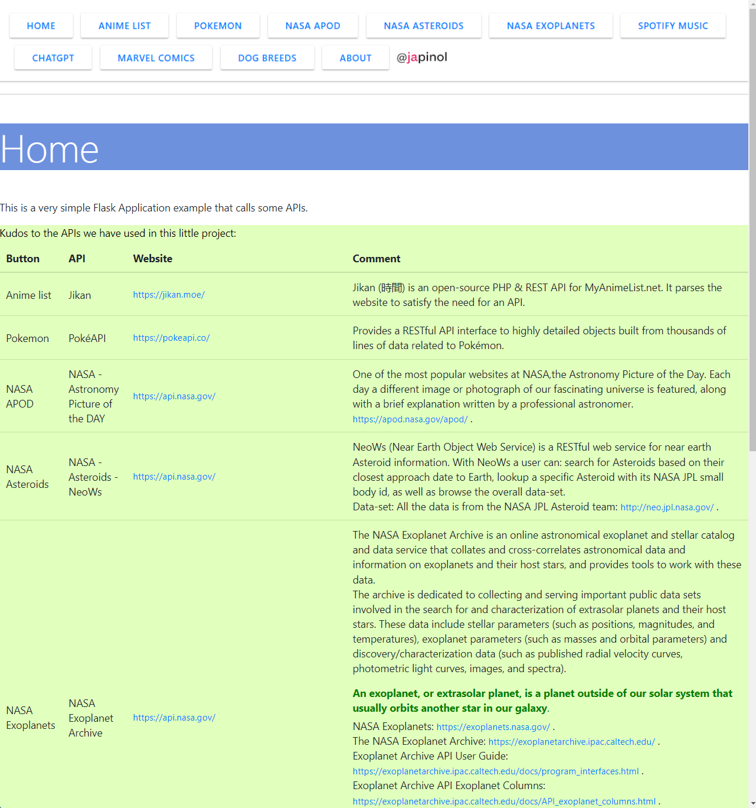
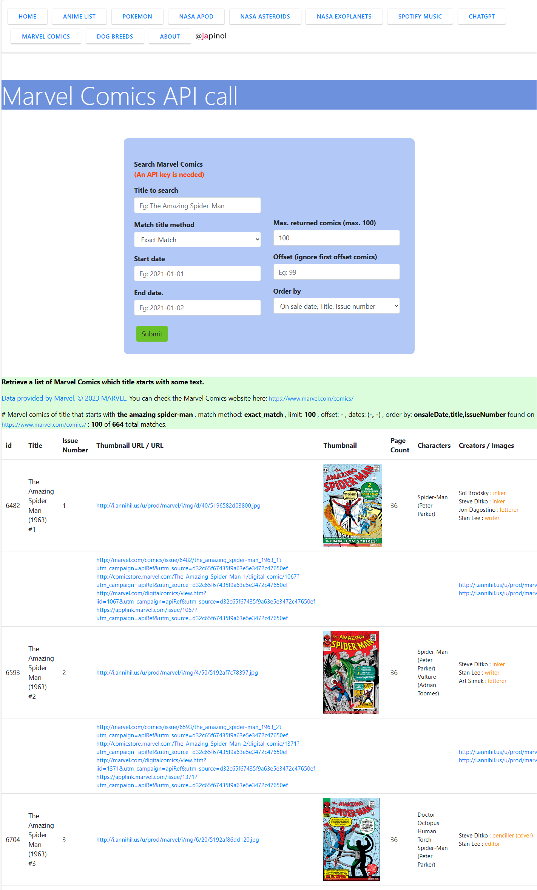
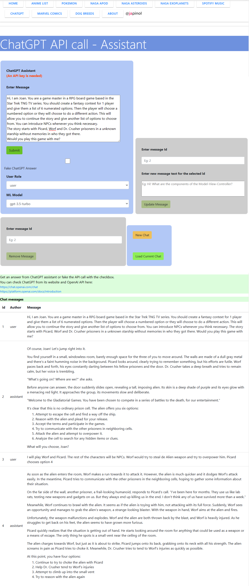

## Flask API Calls
This is a very simple Flask Application example that calls some APIs.

	Objective: Make a very simple Flask Application example that calls some APIs. 
	program: flask-api-calls
	version: 1.1.0
	author: Joan A. Pinol
	author_nickname: japinol
	author_gitHub: japinol7
	author_twitter: @japinol
	Python requires: 3.11 or greater.

## Kudos to the APIs we have used in this little project:
    API                     Website                                     Comment
    ----------------------  ------------------------------------------  ----------------------------------------------------------------------------------
    Jikan                   https://jikan.moe/                          Jikan (時間) is an open-source PHP & REST API for MyAnimeList.net. 
                                                                        It parses the website to satisfy the need for an API.

    PokéAPI                 https://pokeapi.co/                         Provides a RESTful API interface to highly detailed objects built from thousands
                                                                        of lines of data related to Pokémon.

    NASA APOD               https://api.nasa.gov/                       One of the most popular websites at NASA,the Astronomy Picture of the Day. 
                                                                        Each day a different image or photograph of our fascinating universe is featured, 
                                                                        along with a brief explanation written by a professional astronomer.
                                                                        https://apod.nasa.gov/apod/ .

    NASA Asteroids NeoWs    https://api.nasa.gov/                       NeoWs (Near Earth Object Web Service) is a RESTful web service for near earth 
                                                                        Asteroid information. 
                                                                        With NeoWs a user can: search for Asteroids based on their closest approach date to Earth, 
                                                                        lookup a specific Asteroid with its NASA JPL small body id, as well as browse the overall data-set.
                                                                        Data-set: All the data is from the NASA JPL Asteroid team: http://neo.jpl.nasa.gov/ .

    NASA Exoplanet Archive  https://exoplanetarchive.ipac.caltech.edu/  The NASA Exoplanet Archive is an online astronomical exoplanet and stellar catalog 
                                                                        and data service that collates and cross-correlates astronomical data 
                                                                        and information on exoplanets and their host stars, and provides tools to work with these data. 
                                                                        The archive is dedicated to collecting and serving important public data sets 
                                                                        involved in the search for and characterization of extrasolar planets and their host stars. 
                                                                        These data include stellar parameters (such as positions, magnitudes, and temperatures), 
                                                                        exoplanet parameters (such as masses and orbital parameters) and discovery/characterization 
                                                                        data (such as published radial velocity curves, photometric light curves, images, and spectra). 
                                                                        An exoplanet, or extrasolar planet, is a planet outside of our solar system 
                                                                        that usually orbits another star in our galaxy.
                                                                        NASA Exoplanets: https://exoplanets.nasa.gov/ .
                                                                        The NASA Exoplanet Archive: 
                                                                        https://exoplanetarchive.ipac.caltech.edu/ .
                                                                        Exoplanet Archive API User Guide: 
                                                                        https://exoplanetarchive.ipac.caltech.edu/docs/program_interfaces.html .
                                                                        Exoplanet Archive API Exoplanet Columns: 
                                                                        https://exoplanetarchive.ipac.caltech.edu/docs/API_exoplanet_columns.html .
                                                                        Data collected from the Planetary Systems table (PS), which is connected to the Exoplanet Archive TAP service.
                                                                        Please review the TAP User Guide and create a new query for the most current data:
                                                                        <a href="https://exoplanetarchive.ipac.caltech.edu/docs/TAP/usingTAP.html">https://exoplanetarchive.ipac.caltech.edu/docs/TAP/usingTAP.html</a> 
                                                                         Please note the database column names have also changed;
                                                                        this document contains the current definitions and a mapping between the new and deprecated names:
                                                                        <a href="https://exoplanetarchive.ipac.caltech.edu/docs/API_PS_columns.html">https://exoplanetarchive.ipac.caltech.edu/docs/API_PS_columns.html</a> 

    Spotify                 https://developer.spotify.com/documentation/web-api/

                                                                        We use Spotify Web API to retrieve metadata about music artists, albums, 
                                                                        and tracks, directly from the Spotify Data Catalogue.
                                                                        * Web API | Spotify for Developers
                                                                          https://developer.spotify.com/documentation/web-api/
                                                                          https://developer.spotify.com/documentation/web-api/reference/search/
                                                                          https://developer.spotify.com/documentation/general/guides/authorization/
                                                                          https://developer.spotify.com/documentation/general/guides/authorization/app-settings/
                                                                        
                                                                        * We use Spotipy package for the Spotify Web API:
                                                                          * Welcome to Spotipy! — spotipy 2.0 documentation
                                                                            https://spotipy.readthedocs.io/

                                                                        * An API key is needed to request the API
                                                                          * Regarding this example you must create the folder spotify_api_keys in yout $HOME directory
                                                                            with a file containing your Spotify Client ID (spotify_client_id.key)
                                                                            and another file containing your Spotify Client Secret spotify_client_secret.key
                                                                            You can copy this directory structure from the extra folder of this project.
                                                                            Tree from your $HOME directory:
                                                                               .api_keys
                                                                                    spotify_api_keys
                                                                                        spotify_client_id.key
                                                                                        spotify_client_secret.key

    OpenAI ChatGPT           https://platform.openai.com/	            The OpenAI API can be applied to virtually any task that involves
                                                                        understanding or generating natural language or code.
                                                                        We use their API in this project to interact with ChatGPT
                                                                        using the model gpt-3.5-turbo.
                                                                        
                                                                        An API key is needed to request the API.
                                                                            Regarding this example you must create the folder openai_api_keys in the HOME directory
                                                                            with a file containing your API private key marvel_private_key.key
                                                                            You can copy this directory structure from the extra folder of this project.
                                                                                Tree from your $HOME directory:
                                                                                .api_keys
                                                                                    openai_api_keys
                                                                                        openai_private_key.key

                                                                        * ChatGPT website: 
                                                                          https://chat.openai.com/chat

                                                                        * API Documentation: 
                                                                          https://platform.openai.com/docs/introduction
                                                                          https://platform.openai.com/docs/api-reference/introduction

    Marvel Comics           https://www.marvel.com/comics/	            The Marvel Comics API is a tool to help developers everywhere create amazing,
                                                                        uncanny and incredible web sites and applications using data from the 
                                                                        several years of the Marvel age of comics.
                                                                        An API key is needed to request the API.
                                                                            Regarding this example you must create the folder marvel_api_keys in the HOME directory
                                                                            with a file containing your API public key (marvel_public_key.key)
                                                                            and another file containing your API private key marvel_private_key.key
                                                                            You can copy this directory structure from the extra folder of this project.
                                                                                Tree from your $HOME directory:
                                                                                .api_keys
                                                                                    marvel_api_keys
                                                                                        marvel_private_key.key
                                                                                        marvel_public_key.key

                                                                        The Marvel API suite and portal are in beta and is an evolving project.
                                                                        There is really a lot of good stuff to request from Marvel API.
                                                                        Data provided by Marvel. © 2021 Marvel.
                                                                        Developer Portal at Marvel.com: https://developer.marvel.com/
                                                                        API Documentation: https://developer.marvel.com/docs

    Dog API                 https://dog.ceo/dog-api/                    Dog API. Original dataset taken from the the Stanford Dogs Dataset.

## Screenshots

    
    
    
    
    
    
    
    
    

**To make this web server app to work in your local environment**

	Do this:
	    1. Clone this repository in your local system.
	    2. Go to its folder in your system.
	    3. $ pip install -r requirements.txt
	    4. $ flask run
	    5. Open the website indicated in the console in your browser.
	       Example: http://127.0.0.1:5000/
